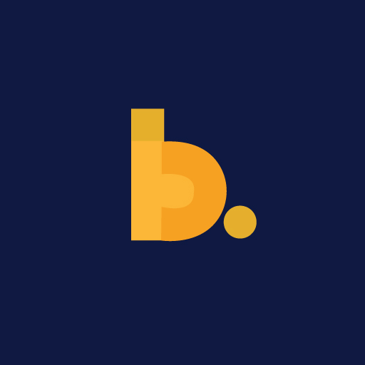

<!-- 

  
Code Keg ⭐️

  

    Code Keg is a collection of common flutter and dart practices and code snippets that we use at Blocship. 
     
     
    <a href="https://blocship.io">About</a>
    ·
    <a href="https://medium.com/blocship">Medium</a>
  

 -->
<!-- Inline CSS Not working following is less ugly -->

  <h1 align="center" >Code Keg ⭐️</h1>
  

    Code Keg is a collection of common flutter and dart practices and code snippets that we use at Blocship. 
     
     
    <a href="https://blocship.io">About</a>
    ·
    <a href="https://medium.com/blocship">Medium</a>
  

### Articles

- [Simplifying Flutter Permission Requests with Dependency Wrapping](./dependency_wrapping.md)
- [Beyond the Basics: A New Theming Approach for Flutter Developers](./theming.md)
- [App configuration in Flutter based on flavor / environment](./config.md)

### Code Snippets

- [Listenable Object](./object_listenable.md)
- [App Settings](./app_settings.md)
- [App Version](./app_version.md)

## How to use

To use the code snippets in your project, copy and paste them while ensuring that the accompanying license is attached.

## License

Distributed under the BSD 3-Clause License. See `LICENSE` for more information.

## Contributing

Contributions are what make the open source community such an amazing place to be learn, inspire, and create. If you have any suggestions, ideas, or feedback, please feel free to open an issue or a pull request.